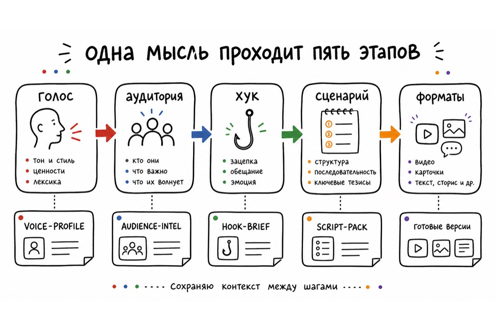
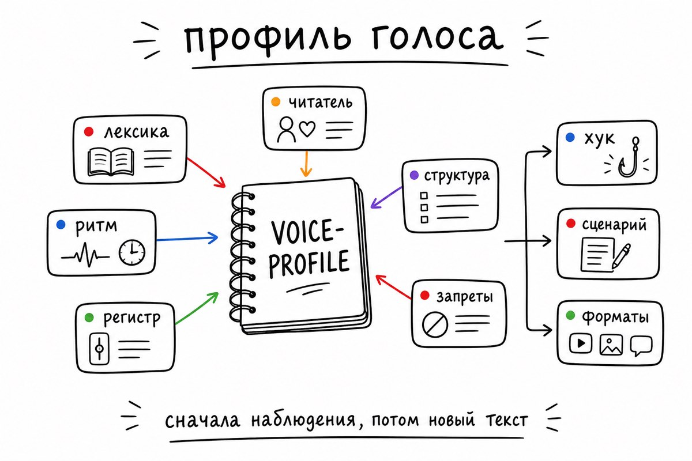
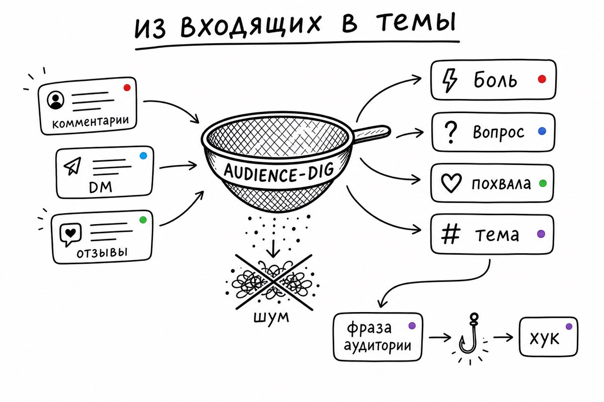
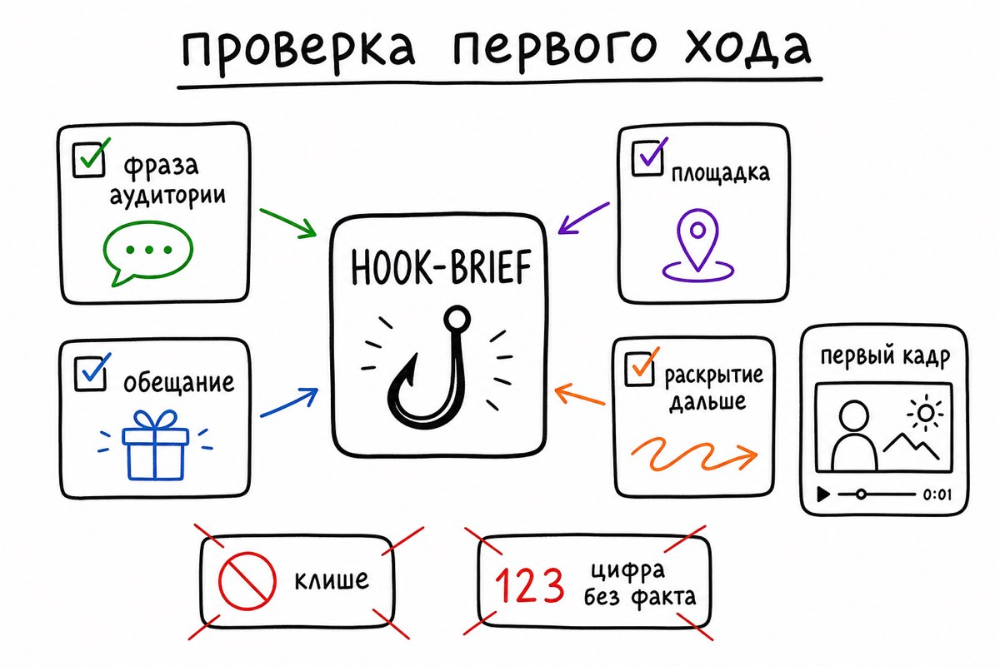
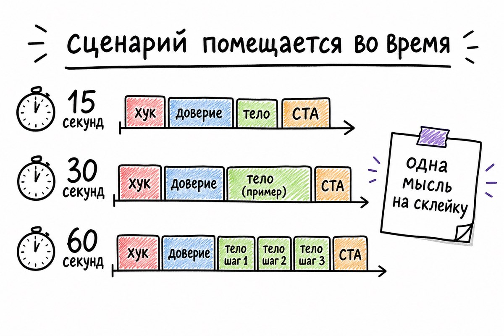
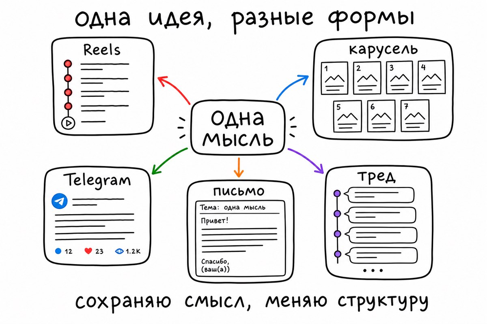

# Metaflora Content Machine

Пять переносимых навыков для работы с контентом. Они разбирают тексты автора и сообщения аудитории, помогают написать начало, сценарий и версии материала для разных площадок.

Навыки можно ставить по одному. Полный набор пригодится, когда один материал нужно подготовить для нескольких форматов и сохранить общий голос автора.


## подробный гид по пяти skills

Ниже входы, результаты, порядок работы, сложные случаи, готовые запросы и контроль перед публикацией.

### что устанавливается

`metaflora-content-machine` состоит из пяти переносимых навыков для AI-агентов. Каждый навык лежит в отдельной папке и содержит `SKILL.md`. Этот файл задаёт агенту роль, входные данные, порядок работы, форму результата и ограничения.

После установки навыки не подключаются к Telegram, Instagram, рассылке или базе данных. Они не публикуют материал и не получают доступ к аккаунтам. В чате агент получает тексты, комментарии, тему или готовый сценарий и возвращает результат по правилам из `SKILL.md`.

Пять результатов передаются по цепочке:

```text
образцы автора ───────> VOICE-PROFILE ───────┐
                                                │
комментарии / DM / отзывы ─> AUDIENCE-INTEL ─> HOOK-BRIEF ─> SCRIPT-PACK ─> форматы
                                                │
                                                └──── стиль автора учитывается на каждом шаге
```

Можно использовать один skill. `repurpose` подойдёт к готовому ролику, когда требуется письмо или карусель. Полный набор удобен для регулярной работы, где один материал выходит в нескольких форматах.



### первый запуск

Соберите пять или шесть собственных постов, сценариев или писем. Не берите случайные цитаты, репосты и тексты другого человека. Отдельно выгрузите двадцать или больше комментариев, личных сообщений или отзывов. Имена, телефоны, ссылки на закрытые чаты и любые личные данные лучше убрать до отправки агенту.

Сначала запустите `voice-print` на собственных материалах. Потом передайте реакцию аудитории в `audience-dig`. Эти два результата задают тему и первую строку. После этого выберите одну тему, подготовьте начало, сценарий и версии для площадок.

Первые проходы не требуют идеального архива. Сохраните `VOICE-PROFILE`, `AUDIENCE-INTEL`, `HOOK-BRIEF` и `SCRIPT-PACK` отдельными файлами или заметками. Тогда можно обновить один этап без повторной работы по всему материалу.

### 1. voice-print разбирает голос автора

##### что даёт voice-print

В `voice-print` передают тексты автора перед подготовкой серии постов, видео, писем или сценариев. Он нужен, когда несколько агентов или людей готовят контент, а тексты начинают звучать по-разному. На выходе получается профиль письма со словами, ритмом, обращением к читателю, типичными конструкциями и границами тона.

Оценки вроде «живой», «экспертный» или «смелый» мало помогают следующему агенту. Ему нужны проверяемые детали: короткие ли абзацы, есть ли вопросы, используются ли термины без расшифровки, где разговорный тон сменяется инструкцией, какие концовки автор не пишет.



##### что передать на вход

Минимальный вход состоит из трёх связанных текстов одного автора. Пять до десяти материалов дают устойчивее картину. Полезно смешивать близкие форматы: несколько Telegram-постов, сценарии вертикальных видео и одно письмо. Тогда профиль покажет общий голос и различия между жанрами.

Вместе с текстами можно указать задачу. Например: «нужен профиль для будущих Reels и постов в Telegram» или «сравни ранние заметки с текстами за последний месяц». Если прислано меньше трёх образцов, результат помечается как предварительный. Двух абзацев для уверенного вывода мало.

Готовый запрос выглядит так:

```text
ниже шесть моих постов и два сценария. собери VOICE-PROFILE
для Telegram и Reels. сохрани рабочие термины, короткие абзацы
и прямое обращение. отдельно покажи, где голос меняется в инструкции.
```

##### что приходит в ответ

Результат называется `VOICE-PROFILE`. Его можно хранить рядом с контент-планом и прикладывать к следующим задачам. Внутри остаются правила, по которым другой агент подготовит новый материал.

```text
VOICE-PROFILE
Уверенность: средняя

Лексика: короткие прямые формулировки, рабочие термины без лишней расшифровки
Ритм: абзацы по 2–4 предложения; после длинного объяснения бывает короткая фраза
Регистр: разговорный вход, суше и точнее в инструкции
Обращение: «ты»; вопросы использует редко
Структура: тезис, личный контекст, конкретные шаги
Не использует: рекламные обещания, общий CTA в конце, слова без факта рядом
Тестовая фраза: «сначала собери один рабочий проход, потом расширяй его»
```

Тестовая фраза нужна для проверки. Если она не похожа на исходные материалы, профиль пересматривают до передачи дальше. Один удачный заголовок не компенсирует чужой ритм во всём тексте.

##### как проходит разбор

Сначала агент читает все образцы целиком. Выдёргивание пары любимых фраз даёт искажённую картину. Потом он отмечает повторяющиеся привычки по шести слоям.

Первый слой, лексика. Здесь остаются характерные слова, рабочие термины, типичные связки и слова, которых автор избегает. Второй слой, ритм. Он показывает длину фраз, скорость перехода между мыслями и привычки пунктуации. Третий слой, регистр. В нём видно, где автор говорит по-дружески, а где сдержанно объясняет инструкцию.

Дальше описывается отношение к читателю. Автор пишет «ты», «вы», без обращения или через личный опыт. Затем фиксируется структура. Некоторые начинают с эпизода, другие с тезиса, третьи сначала показывают ошибку. Последний слой содержит запреты. Следующие тексты не используют приёмы, которых в образцах нет.

Если короткие посты и длинные статьи звучат по-разному, профиль хранит оба режима. Усреднение в таком случае убирает полезную разницу.

##### три рабочих ситуации

**серия Telegram-постов.** В образцах много коротких абзацев, технических слов и личных наблюдений. Профиль закрепляет этот ритм. `hook-lab` получает ограничения по первой строке. `script-smith` использует их в закадровом тексте.

**вертикальные видео.** Сценарии показывают разговорный язык и короткие фразы. Профиль помогает не превратить ролик в статью, которую читают перед камерой. Внутри длинного видео он может разрешить более подробный объясняющий блок.

**технические заметки и письма.** Один и тот же автор пишет нейтральнее в документации и живее в письмах. Профиль хранит два режима. Следующий навык получает нужный режим вместе с платформой.

##### сложные случаи

Тексты на разных языках требуют отдельных профилей. Английские фразы и русская пунктуация не складываются в один стиль автоматически. Профиль также следует обновлять, если старые посты заметно отличаются от новых. В обновление входят только подтверждённые изменения, а не случайная фраза из одного материала.

Чужие публичные тексты подходят для разбора приёмов, структуры и жанра. Навык не предназначен для копирования чужого голоса по нескольким публикациям. При смешанном авторстве сначала нужно отделить материалы и назвать границу задачи.

##### что передаётся дальше

Для `hook-lab` используют лексику, ритм, обращение к читателю и запреты из профиля. Для `script-smith` добавляют правила построения начала и объяснения сложной мысли. В `repurpose` профиль прикладывают к готовому исходнику, чтобы смена формата не меняла голос автора.

```text
используй этот VOICE-PROFILE при подготовке сценария:
[вставить профиль]

сохрани короткие абзацы, прямое обращение и рабочие термины.
не добавляй рекламные обещания и общий CTA.
```

### 2. audience-dig разбирает сообщения аудитории

##### что даёт audience-dig

Комментарии, DM и отзывы часто остаются лентой сообщений. В них лежат прямые вопросы, попытки решить проблему, возражения и причины покупки. Пока они не собраны в карту, темы выбираются по памяти или наугад.

В `audience-dig` передают массив реплик и получают `AUDIENCE-INTEL`. Это отчёт о повторениях, эмоциональных маркерах, явных вопросах, конкретной похвале и формулировках проблемы на языке аудитории. В нём есть материал для выбора темы и первой строки.



##### что передать на вход

Подойдут комментарии под собственными постами, личные сообщения, отзывы после продукта, заметки с созвонов и комментарии под материалами конкурентов. Если источников несколько, их стоит подписать. Реакция под обзором и сообщения после покупки отвечают на разные вопросы.

Можно попросить анализировать весь массив или выбрать фокус: боли, частые вопросы, причины покупки, негатив, будущие темы, формулировки для лендинга. Перед отправкой уберите имена, контакты, адреса, закрытые ссылки и детали, по которым можно узнать человека.

```text
ниже 86 комментариев и 24 сообщения после бесплатного гайда.
собери AUDIENCE-INTEL. ищи повторяющиеся проблемы, прямые вопросы,
похвалу с конкретной причиной и темы для следующей серии роликов.
не переноси личные данные в ответ.
```

##### что приходит в ответ

`AUDIENCE-INTEL` сохраняет источник, объём данных и уверенность. Низкая уверенность при восьми репликах честнее, чем громкий вывод. Отдельно важна разница между реакцией «спасибо» и похвалой, где человек называет причину. Вторая помогает понять, какую пользу люди уже получили.

```text
AUDIENCE-INTEL
Источник: 86 комментариев и 24 сообщения
Уверенность: высокая

Повторяющийся запрос: «не понимаю, с чего начать» — 17 упоминаний
Эмоциональный контекст: раздражение от несвязанных уроков и длинных подборок
Явный вопрос: «какой инструмент взять первым?» — 11 упоминаний
Похвала с конкретикой: короткие схемы и готовые шаги
Формулировка проблемы: «я трачу вечер на разбор, а к работе не перехожу»

Темы:
1. первый рабочий сценарий за один вечер
2. три ошибки на старте
3. как выбрать один инструмент под конкретную задачу
```

##### как идёт разбор

Агент читает весь массив и отделяет содержательные сообщения от шума. Спам, одинаковые реакции и реплики без контекста не влияют на вывод. Затем похожие сообщения группируются. Вопрос и боль остаются в разных категориях, даже если в них встречается одно слово.

После группировки считается повторяемость. Эмоциональная сила тоже учитывается, но не заменяет частоту. Одна резкая жалоба может показать тему для личного ответа. Повторяющаяся формулировка помогает выбрать тему для публикации.

Дальше агент собирает прямые вопросы, проблемные формулировки и конкретные причины похвалы. В конце появляются темы и несколько первых строк на основе реальных слов аудитории. Имена и другие идентифицирующие детали в финальный отчёт не попадают.

##### три ситуации из практики

**сорок комментариев под роликами.** В начале много коротких реакций. Навык отбрасывает их и видит, что люди тринадцать раз спрашивают про первый шаг. Это становится темой объясняющего ролика.

**переписка после бесплатного гайда.** Здесь часто встречается благодарность. Полезными оказываются сообщения, где человек называет причину: «по таблице наконец понятно, что делать первым». Из них получается тема о порядке действий.

**комментарии у конкурента.** Их можно использовать для анализа паттернов и незакрытых вопросов. Формулировки не переносятся в публикацию дословно. После разбора они переписываются под свой продукт и свой голос.

##### сложные случаи

При массиве меньше десяти реплик навык помечает вывод как предварительный. Сарказм и двусмысленные сообщения не читаются буквально, они остаются в отдельной заметке. При смешанных языках сначала строятся отдельные группы, потом соединяются только совпадающие по смыслу паттерны.

Один активный комментатор не должен создавать ложную частотность. Конфликтующие сегменты аудитории тоже нельзя склеивать. В таком случае отчёт показывает, для какого сегмента подходит каждая тема. Старые отзывы стоит пометить датой, если продукт уже изменился.

##### что передаётся дальше

Для `hook-lab` берут одну или две реальные фразы, выбранную тему и площадку. Для `script-smith` добавляют вопросы, на которые нужно ответить, и факты. В `repurpose` передают готовый материал вместе с исходной темой.

```text
используй эти фразы из AUDIENCE-INTEL:
«я уже пробовал, но опять бросил»
«не понимаю, с чего начать»

нужны варианты первого кадра для Reels. не обещай результат,
который ролик не сможет показать дальше.
```

### 3. hook-lab пишет первые строки

##### что делает hook-lab

Тема может быть нормальной, а первая строка слишком общей. «Как начать вести блог» не даёт причины остановиться. «Хотите больше заявок?» обещает многое и не объясняет, кому это относится. Ещё хуже, когда хук звучит громко, а тело ролика не раскрывает обещание.

`hook-lab` получает тему, площадку, аудиторию и голос автора. На выходе выходит `HOOK-BRIEF`. В нём видно, кому адресована первая строка, какую мысль нужно раскрыть дальше и где у выбранной формулы есть риск.



##### что передать на вход

Минимум, тема или ниша. Полный вход заметно точнее: площадка, язык, фраза аудитории, подтверждённый результат, `VOICE-PROFILE`, желаемое число вариантов и ограничения. Ограничения полезны, когда нужны варианты без цифр, без давления, под B2B или без обращения на «ты».

```text
тема: фрилансер теряет заявки в Telegram
площадка: Reels
длительность: 45 секунд
фраза аудитории: «мне пишут, а потом я теряю человека в личке»
голос: [вставить VOICE-PROFILE]
нужно 6 вариантов. без выдуманных цифр и рекламных клише.
```

Если площадка не указана, для черновика берут короткое видео и пишут это в ответе. Для треда, карусели или YouTube контекст задают отдельно. Первый кадр и первая строка текста работают по-разному.

##### что приходит в ответ

Результат можно оформить так:

```text
HOOK-BRIEF
Площадка: Reels
Длительность: 45 секунд
Формула: зеркало боли
Первая строка: «тебе пишут по работе, а через день ты уже не помнишь, кому обещал ответить»
Аудиторная фраза: «теряю человека в личке»
Что нужно раскрыть: простой порядок меток и следующего действия
Текст на первом кадре: «заявки теряются в Telegram»
Риск: не обещать, что одна система заменит продажу
Переход в сценарий: показать один пример переписки и три действия
```

`HOOK-BRIEF` полезнее списка из десяти фраз. Следующий этап понимает, какую мысль подтверждать, какую аудиторию держать в кадре и какой тон сохранить.

##### семь ходов и условия выбора

**зеркало боли.** Берёт узнаваемую ситуацию из слов аудитории. Подходит, когда проблема уже повторяется в комментариях или DM. Слабый вариант говорит «у тебя проблемы с заявками». Рабочий вариант показывает момент потери: «тебе пишут по работе, а к вечеру чат уже ушёл вниз».

**открытие желания.** Формулирует желаемый результат без обещаний, которые нельзя подтвердить. Подходит, когда аудитория уже знает проблему и ищет понятный порядок действий. Нужен конкретный результат: «собери очередь идей на месяц из своих комментариев».

**разрыв любопытства.** Открывает вопрос, который материал потом закрывает. Он держится на реальном payoff. Если видео не отвечает на вопрос, формулу лучше не брать.

**контринтуитивная мысль.** Нужна там, где у аудитории есть распространённое действие, которое приводит к слабому результату. Утверждение должно опираться на объяснение или пример. Фраза ради спора не заменяет аргумент.

**предъявление результата.** Использует подтверждённый кейс, цифру или факт. Без проверки цифры и детали не применяются. Можно показать результат без цифры, если есть наблюдаемый артефакт, например экран готовой очереди публикаций.

**было / стало.** Показывает переход из конкретного состояния в другое. Он годится, когда зритель легко видит разницу. Абстрактное «было сложно, стало легко» ничего не объясняет.

**обрыв паттерна.** Подходит для формата, где ожидание легко нарушить одной точной фразой. В текстовом треде он часто слабее, чем в коротком видео. Его не стоит использовать ради странности.

##### как готовятся варианты

Сначала фиксируется площадка и момент чтения. В Reels первая строка должна работать вместе со звуком и текстом на экране. В карусели ей нужно держать первый слайд. В Telegram важны первая строка и начало абзаца. Для YouTube можно дать чуть больше контекста за первые секунды.

Потом агент выделяет боль, желание, конфликт или подтверждённый факт. Он сверяет их с формулами и убирает натянутые варианты. Дальше проверяет обещания, цифры и payoff. Вариант готов, когда понятно, чем основной текст отвечает на первую строку.

Последним шагом включается голос автора. `VOICE-PROFILE` меняет лексику, длину фразы и прямоту обращения. Формула остаётся той же, но хук перестаёт звучать как чужой шаблон.

##### режимы для площадок

| Площадка | Где работает хук | Что ему нужно |
| --- | --- | --- |
| Reels, TikTok, Shorts | 0–3 секунды, звук и текст на экране | конкретная ситуация, короткая формулировка, ясный переход |
| Карусель | первый слайд | одна крупная мысль без перегруза |
| Telegram | первая строка и абзац | причина читать дальше без искусственной интриги |
| X, Threads | первые 1–2 предложения | самостоятельный тезис, который ведёт к нити |
| YouTube | первые 5–15 секунд | тезис и намёк на доказательство |
| LinkedIn | начало поста | спокойный тон, факт или наблюдение вместо визуального трюка |

##### три коротких разбора

**заявки в Telegram.** Сырой бриф говорит «хочу больше ответов». После `audience-dig` появляется фраза «теряю человека в личке». Хук делает проблему видимой. В сценарий уходит обещание показать порядок меток и следующего действия.

**автор бросает контент через неделю.** Сырой запрос просит «мотивационный ролик». В комментариях повторяется «я уже пробовал, но опять бросил». `hook-lab` начинает с причины: план требует ежедневно придумывать тему. Дальше сценарий объясняет, как подготовить очередь тем.

**B2B-команда не показывает кейсы.** Сырой запрос говорит «нужен ролик про кейсы». Сначала уточняется причина: команда хранит результат в чатах и не собирает доказательства. В первой строке предлагают схему сохранения факта после каждого проекта.

##### границы hook-lab

Он не придумывает статистику, не подменяет аудиторию словами автора и не копирует публичный голос другого человека. Один хук не переносится автоматически на все площадки. Если для темы нет честного доказательства, результат должен быть аккуратнее по обещанию.

##### что передаётся дальше

`script-smith` получает готовый `HOOK-BRIEF`, факты, желаемую длительность и CTA. Сценарий сразу переходит к первому блоку и держит заданную тему.

### 4. script-smith готовит сценарий

##### что делает script-smith

Готовый хук ещё не делает готовым ролик. Частая ошибка, сценарий звучит как статья, которую пытаются прочитать в кадре. На пятнадцати секундах получается скороговорка. На минуте появляются абзацы без новой мысли. В ролике без озвучки текст перегружает экран. Общий CTA в конце не ведёт к следующему действию.

`script-smith` собирает `SCRIPT-PACK`. В нём есть тайминг, реплики, текст на экране, подтверждающие материалы, CTA и мысли, которые не поместились. Это рабочая заготовка для съёмки, монтажа и последующей адаптации.



##### что передать на вход

Минимум, тема или готовый `HOOK-BRIEF`. Полный вход содержит платформу, длительность, формат кадра, тезисы, факты, обязательные примеры, нужное действие после просмотра, голос и ограничения. Ограничения бывают техническими: без лица, только субтитры, один дубль, экранная запись, доступный B-roll.

```text
возьми этот HOOK-BRIEF и собери ролик на 45 секунд.
формат: говорящая голова и один скрин.
обязательные факты: три статуса в Telegram и пример очереди.
CTA: сохранить ролик и взять шаблон.
голос: [вставить VOICE-PROFILE]
```

##### четыре блока сценария

**хук** занимает первые секунды. Он повторяет подготовленное обещание и не тратит время на новые вводные. **доверие** объясняет, почему зрителю стоит остаться: личный опыт, демонстрация, факт или конкретный пример. В этом блоке нельзя повторять хук другими словами.

**тело** раскрывает одну мысль через последовательные шаги, кадры или доказательства. Для видео полезно правило «одна мысль на склейку». При каждом переходе зритель понимает, что поменялось. **CTA** называет одно действие, которое реально доступно на площадке: сохранить, открыть ссылку, написать слово, посмотреть следующую часть.

##### режимы длительности

| Длительность | Что помещается | Что убрать первым |
| --- | --- | --- |
| 15 секунд | один ход; хук и доверие почти соединяются | лишние объяснения и второй пример |
| 30 секунд | один тезис и один конкретный пример | дополнительные ответвления темы |
| 45–60 секунд | 2–3 последовательных шага | параллельные темы и повтор хука |
| 90 секунд и больше | разбор с мини-хуками каждые 20–25 секунд | монотонные длинные объяснения |

В ролике без озвучки на экран попадают короткие смысловые блоки, между ними остаётся время на чтение. Для экранной записи текст привязывается к действию на экране. В сторис один экран несёт одну мысль и заканчивается нативным действием: вопросом, ссылкой, опросом или переходом дальше.

##### как строится сценарий

Сначала агент берёт выбранную первую строку. Потом считает, сколько мыслей помещается в выбранное время. Каждой мысли нужен факт, пример, экран или демонстрация. При отсутствии доказательства формулировку сужают или переносят тезис в отдельный ролик.

Дальше текст раскладывается по кадрам. Сценарий проговаривается как устная речь. Перегруженные места сокращаются. CTA сверяется с реальным действием. В финале остаётся `SCRIPT-PACK`, который можно отдать оператору, монтажёру или следующему агенту.

```text
SCRIPT-PACK
Тема: заявки теряются в Telegram
Хук: ...
Длительность: 45 секунд
Платформа: Reels
Реплики и тайминг: ...
Текст на экране: ...
B-roll и скрины: ...
Факты для проверки: ...
CTA: ...
Неиспользованные тезисы: ...
```

##### одна тема, три сценария

Тема «заявки теряются в Telegram» на пятнадцати секундах показывает только одну проблему и одно действие: поставить метку сразу после сообщения. На сорока пяти секундах можно показать три статуса, короткий пример очереди и напомнить о следующем действии. В девяноста секундах появляется разбор всего цикла: первое сообщение, квалификация, обещанный ответ, контроль срока и возврат к диалогу.

Тексты нельзя получить простым обрезанием длинной версии. Меняется количество мыслей, доказательств, кадров и пауз.

##### частые ошибки в сценарии

Пять тезисов за тридцать секунд не становятся понятнее от ускорения речи. Повтор хука в блоке доверия забирает время у доказательства. Общий CTA вроде «подписывайся» теряет связь с темой. Кейс без факта остаётся заявлением. Ролик стоит проговорить вслух до записи: фраза, которую невозможно сказать естественно, редко звучит лучше в дубле.

##### что передаётся дальше

`repurpose` получает структуру, факты, голос, CTA и неиспользованные тезисы. Он сохраняет центральную мысль и меняет форму под следующий носитель.

### 5. repurpose адаптирует материал для площадок

##### когда использовать repurpose

Один готовый ролик часто становится источником для поста, карусели, письма, треда и Pinterest. Копирование сценария по строкам даёт подписи, похожие на субтитры. У карусели, письма и треда разный способ чтения, длина и действие в финале.

`repurpose` сначала извлекает центральную мысль из исходника. Потом строит отдельную структуру для каждой площадки. На выходе получаются самостоятельные заготовки, которые держат общий смысл и не повторяют одинаковые формулировки.



##### что передать на вход

Подойдёт готовый сценарий, текст карусели, транскрипт голосового, набор тезисов или одна хорошо раскрытая идея. Полезно указать желаемые форматы, `VOICE-PROFILE`, выбранный хук и ограничения по длине. Если исходник содержит несколько разных мыслей, их нужно разделить до пересборки или попросить обработать каждую отдельно.

```text
вот SCRIPT-PACK ролика. собери карусель на 7 слайдов,
пост в Telegram и короткое письмо. используй VOICE-PROFILE.
сохрани факты. не делай из видео субтитры в другом формате.
```

##### что меняется в каждом формате

У короткого видео остаётся темп, паузы и склейки. Карусель строится вокруг одного тезиса на слайд. В посте первая строка выполняет роль входа, дальше появляется больше контекста. Письмо может спокойнее развить историю и вынести полезное действие в конец. Тред делит мысль на отдельные сообщения. Pinterest требует самостоятельный заголовок и короткое описание.

Пересборка начинается с извлечения центральной мысли и опорных фактов. Только после этого выбирается структура конкретной площадки. Такой порядок защищает материал от дословной переделки.

##### как готовятся версии для площадок

Из сценария видео он берёт хук, аргумент и доказательства, а заметки о темпе и монтаже оставляет внутри видео. Из карусели вытаскивает главный тезис и уроки, не переносит нумерацию слайдов. Из транскрипта сначала убираются повторы, оговорки и уходы в сторону. Одна строка или сырой тезис сначала разворачивается в понятную мысль с примером, затем уходит в форматы.

##### ограничения

Короткую мысль не растягивают до письма, если материала не хватает. При сжатии узкой технической темы могут потеряться важные детали. Такое ограничение указывают в результате. Один исходник можно подготовить только для нужных форматов.

##### что остаётся под контролем человека

Навыки готовят материал, но не проверяют реальный факт за автора. Перед публикацией нужно сверить цифры, даты, цитаты, ссылки, примеры и обещание в первом абзаце. Нужна отдельная проверка прав на исходные материалы и персональные данные. Решение о публикации остаётся у человека, который знает контекст и обязательства перед аудиторией.

### один проход от комментария до серии публикаций

Представим автора, который ведёт Telegram и снимает короткие видео. В комментариях часто появляется фраза «я уже пробовал, но опять бросил». Сначала `audience-dig` показывает, что проблема повторяется вокруг ежедневного поиска темы. `voice-print` фиксирует прямой тон, короткие абзацы и отсутствие рекламных обещаний.

`hook-lab` пишет первую строку о том, что контент ломается ещё на этапе планирования. `script-smith` готовит ролик на сорок пять секунд с демонстрацией очереди тем. `repurpose` делает из сценария карусель с шагами, Telegram-пост с личным контекстом и письмо с одним упражнением.

В каждой версии остаётся одна мысль: проблема начинается раньше съёмки. Меняется способ её развернуть, длина и действие в финале.

### контрольный список перед первым запуском

1. установите нужные папки навыков в среду агента;
2. подготовьте 3–10 собственных текстов для `voice-print`;
3. обезличьте комментарии, DM и отзывы для `audience-dig`;
4. сохраните четыре промежуточных результата после каждого шага;
5. укажите площадку, длительность и ограничения перед созданием хука или сценария;
6. проверьте факты, ссылки и данные людей перед публикацией.

### куда идти дальше

- [установка и совместимость](docs/installation.md)
- [рабочие сценарии](docs/workflows.md)
- [контракты всех навыков](docs/skill-reference.md)
- [примеры входов и результатов](docs/examples/)
- [приватность и этика](docs/privacy-and-ethics.md)


## установка

Каждый навык лежит в отдельной папке и содержит один `SKILL.md`. Можно поставить один навык или весь набор.

### Claude.ai

1. Скачайте нужную папку, например `hook-lab`.
2. Заархивируйте именно папку навыка.
3. В Claude откройте `Settings` → `Customize` → `Skills`.
4. Создайте навык и загрузите один архив.

Claude.ai принимает навыки по одному. Для полного набора загрузите пять архивов.

### Claude Code

Проектная установка:

```bash
cp -R hook-lab .claude/skills/hook-lab
```

Личная установка:

```bash
mkdir -p ~/.claude/skills
cp -R hook-lab ~/.claude/skills/hook-lab
```

### Codex

Проектная установка:

```bash
cp -R hook-lab .codex/skills/hook-lab
```

Личная установка:

```bash
mkdir -p ~/.codex/skills
cp -R hook-lab ~/.codex/skills/hook-lab
```

### OpenCode

Поддерживаемые проектные пути:

```text
.opencode/skills/<skill-name>/SKILL.md
.claude/skills/<skill-name>/SKILL.md
.agents/skills/<skill-name>/SKILL.md
```

Поддерживаемые личные пути:

```text
~/.config/opencode/skills/<skill-name>/SKILL.md
~/.claude/skills/<skill-name>/SKILL.md
~/.agents/skills/<skill-name>/SKILL.md
```

Подробнее: [установка и совместимость](docs/installation.md).

## примеры результатов

В [папке примеров](docs/examples/) лежат развёрнутые входы и ожидаемая форма ответа для каждого навыка:

- [`voice-print`](docs/examples/voice-print.md)
- [`audience-dig`](docs/examples/audience-dig.md)
- [`hook-lab`](docs/examples/hook-lab.md)
- [`script-smith`](docs/examples/script-smith.md)
- [`repurpose`](docs/examples/repurpose.md)


## ограничения и аккуратность

- Не вставляйте личные данные клиентов, номера телефонов, адреса, закрытые ссылки и ключи доступа.
- Комментарии конкурентов можно анализировать как источник паттернов. Формулировки и материалы не следует переносить дословно в свой контент.
- `voice-print` предназначен для собственного голоса, команды с разрешением или явно согласованного бренд-стиля. Он не предназначен для имитации публичного человека по нескольким текстам.
- Любая статистика, дата, цитата и результат в готовом контенте требуют проверки до публикации.
- Навыки готовят черновики и структуру. Решение о публикации остаётся за человеком, который знает факты, контекст и обязательства перед аудиторией.

Подробности: [приватность и этика](docs/privacy-and-ethics.md).

## структура репозитория

```text
metaflora-content-machine/
├── audience-dig/SKILL.md
├── hook-lab/SKILL.md
├── repurpose/SKILL.md
├── script-smith/SKILL.md
├── voice-print/SKILL.md
├── assets/                 # белые sketchnote-изображения
├── docs/
│   ├── content-machine-guide.md
│   ├── workflows.md
│   ├── installation.md
│   ├── skill-reference.md
│   ├── privacy-and-ethics.md
│   ├── glossary.md
│   └── examples/
└── README.md
```

## вклад и развитие

Перед добавлением нового навыка проверьте четыре вещи:

1. У него есть конкретный вход, результат и условие запуска.
2. Он не дублирует существующий этап без новой функции.
3. У него есть правила для малого объёма данных, неоднозначности и приватных материалов.
4. В `SKILL.md` есть границы: чего навык не делает и какие допущения обязан назвать.

Новые идеи и исправления оформляйте через issue или pull request. Не прикладывайте в issue закрытые переписки, персональные данные и токены. Полный порядок описан в [CONTRIBUTING.md](CONTRIBUTING.md), правила раскрытия уязвимостей — в [SECURITY.md](SECURITY.md).

## версия

`v1.0.0` — первый публичный выпуск пяти связанных навыков.
