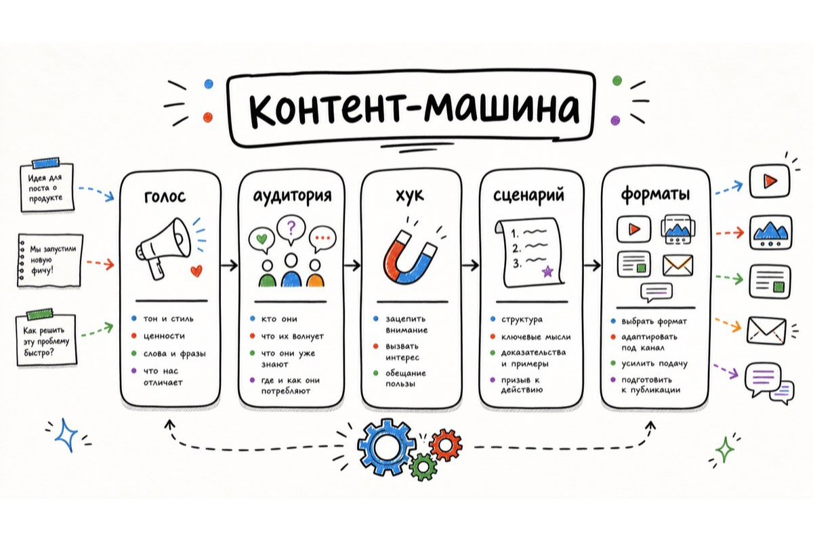
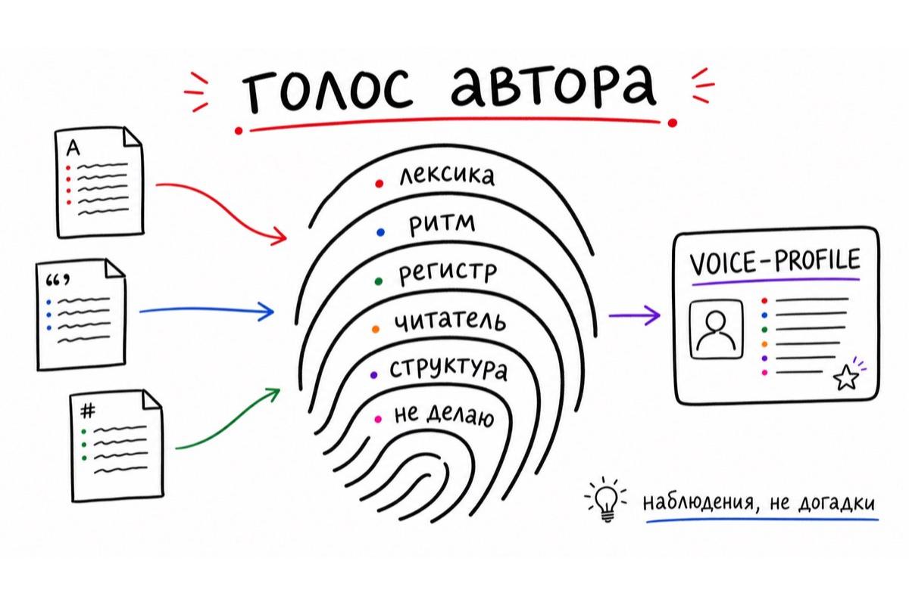
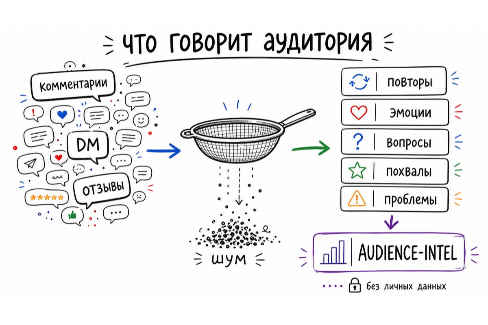
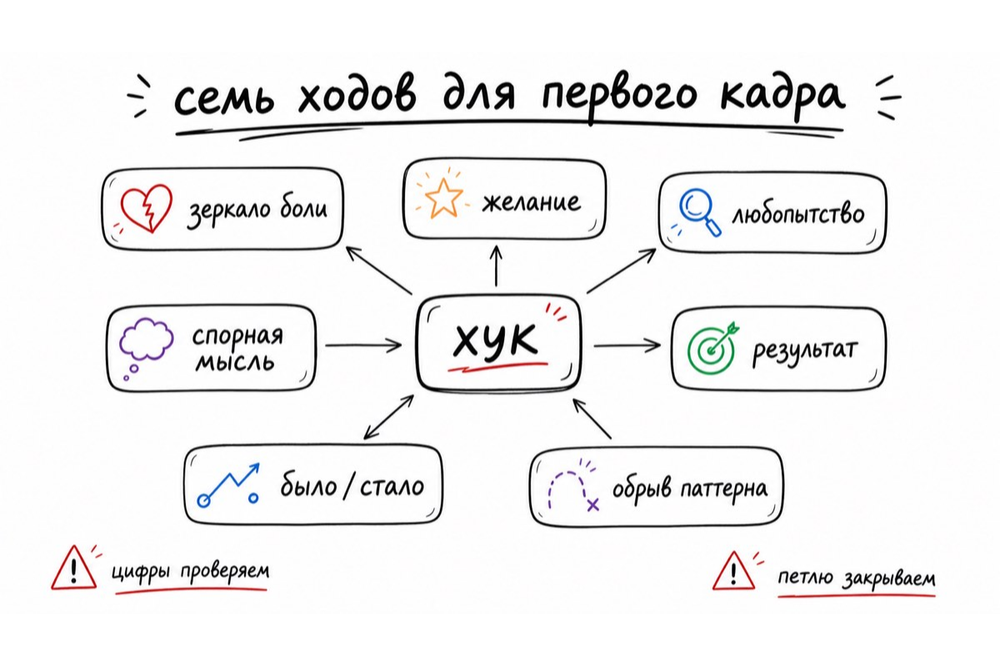
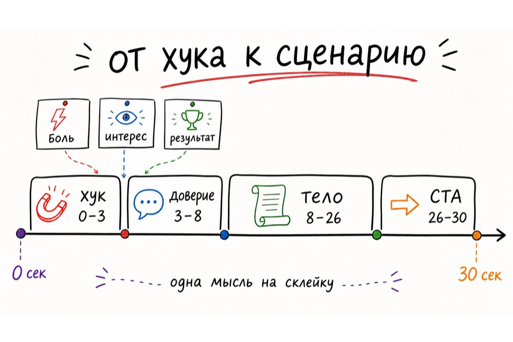

# Рабочие сценарии

## Полный контентный цикл

Этот сценарий нужен, когда есть и исходные тексты автора, и доступ к реакции аудитории.



### Шаг 1. Снять голос

В `voice-print` отправляются 3–10 связанных материалов. Лучше брать тексты одного периода и близкого формата: несколько постов, серия писем, сценарии роликов. Смешанный набор тоже подходит, если хочется увидеть диапазон голоса. Профиль нужно сохранить в контексте следующей задачи.

**Результат:** правила лексики и ритма, границы регистра, привычки структуры, запрещённые для голоса приёмы, тестовая фраза.



### Шаг 2. Разобрать аудиторию

В `audience-dig` идут комментарии, DM, отзывы и вопросы из созвонов. Перед отправкой полезно убрать имена и ссылки. Навык отделит содержательные реплики от спама и соберёт устойчивые паттерны.

**Результат:** слова аудитории, вопросы, точки раздражения, конкретная польза, которую люди уже заметили.



### Шаг 3. Найти первый ход

В `hook-lab` передаются тема, площадка и выводы из `AUDIENCE-INTEL`. Для короткого видео лучше сразу указать длительность и формат кадра. Для треда или карусели важен контекст чтения.

**Результат:** семь формул или меньше, если часть из них не подходит теме; у каждого варианта есть объяснение и ограничение.



### Шаг 4. Собрать главный формат

В `script-smith` выбранный хук превращается в сценарий. Вход дополнительно включает длительность, факты, примеры, желаемое действие в финале и `VOICE-PROFILE`.

**Результат:** текст с таймингом, который можно проговорить, снять и отдать в монтаж.



### Шаг 5. Развести материал по площадкам

В `repurpose` передаётся готовый сценарий и список площадок. Для каждой площадки задаётся отдельное действие, поэтому карусель не выглядит раскадровкой из видео, а письмо не читается как субтитры.

**Результат:** самостоятельные заготовки под каждую площадку.


## Быстрый сценарий без полного набора

### Есть только одна тема

Запустите `hook-lab`, затем `script-smith`. В ответе заранее пометьте, что боль аудитории пока задана как гипотеза. После первых реакций можно вернуться в `audience-dig` и обновить формулировки.

### Есть готовый ролик или пост

Начинайте с `repurpose`. Он вытащит центральную мысль и перестроит её под другие площадки. Если нужен новый голос, перед этим запустите `voice-print`.

### Есть много входящих и непонятно, о чём писать

Начинайте с `audience-dig`. Он даст список тем, который можно превратить в очередь контента: самый частый вопрос идёт в объясняющий ролик, сильная боль — в хук, конкретная похвала — в кейс или письмо.

## Передача результата между навыками

Не нужно вручную пересказывать весь предыдущий ответ. Достаточно передать нужный блок.

```text
используй этот VOICE-PROFILE при написании сценария:
[вставить профиль]

используй эти формулировки из AUDIENCE-INTEL:
[вставить 2–4 фразы]
```

Сохраняйте четыре сущности отдельно: `VOICE-PROFILE`, `AUDIENCE-INTEL`, выбранные хуки и утверждённый исходник. Они помогают обновлять конкретный этап, не перезапуская весь процесс.

## Контроль перед публикацией

1. Проверьте факты, цифры, сроки и чужие цитаты.
2. Проговорите сценарий вслух и уберите фразы, которые не звучат естественно.
3. Сверьте CTA с реальным действием на площадке.
4. Убедитесь, что данные клиентов и собеседников не попали в текст или визуал.
5. После публикации сохраните реакции. Они станут входом для следующего прохода `audience-dig`.
